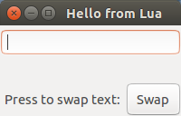
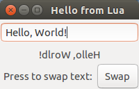

# Luadicrous
### Cross Platform MVVM development in Lua and Xml!

## Overview
Luadicrous is a wrapper around NLua and Gtk# that aims to bring beginner friendly, WPF inspired software development to Linux, Mac, and Windows.

Luadicrous apps are written in Lua and Xml with built in support for the Model-View-ViewModel (MVVM) application architecture. Views are defined in Xml and have a reference to a Lua script that builds a ViewModel. ViewModels contain **BindableProperty** fields and functions which are bound to properties and events on the UI. 

Luadicrous also supports messaging via an event aggregator (implemented) and templating (coming soon).


## Runtime and Build Environment
Luadicrous depends on the Mono and Gtk# runtimes.

### Windows
[Mono and Gtk# installers for Windows](http://www.mono-project.com/download/#download-win)

Download and run the Mono and Gtk# installers seperately.

### Linux

[Mono for Linux](http://www.mono-project.com/download/#download-linux)

Follow the installation instructions for your platform.

### Mac

[Mono for Mac](http://www.mono-project.com/download/#download-mac)

Download and install Mono, GTK is packaged with Mono on Mac.

## Demo application

### Build the framework from source.
Create a folder to contain your Luadicrous project (this folder will be refered to as your application folder).
Build the Luadicrous.csproj project under the release configuration and copy the contents of the /bin/Release folder to a /bin/ directory in your application folder. You may need to manually restore nuget packages to build succesfully. 

## 1. Having your app pull itself up by its own bootstraps.
Create an app.lua file directly in your application folder. This script will need to create a window and load a control into it.

### /app.lua
```lua
import 'Luadicrous.Framework.dll'
import 'Luadicrous.Framework'

-- Creates a Window object with title text
window = Window("Hello from Lua!") 

-- Loads the root view from the xml file that we will create next. Comment out these 2 lines of code to create an empty window.
shell = Control.LoadFromSource("Views/ShellView.xml")

-- Adds the shell to the window. Windows can only contian 1 thing at a time.
window:AddChild(shell)

-- Show the window to the user!
window:Render()

``` 

## 2. Create a GUI

Create a Views folder and add this xml code to it.

### /Views/ShellView.xml

```xml
<?xml version="1.0" encoding="UTF-8" ?>
<!-- The control will run the ViewModels/ShellViewModel.lua script to create its view model. -->
<Control BindingContext="ViewModels/ShellViewModel.lua">
    <!-- A vertical panel lays out controls from top to bottom. -->	
    <VerticalPanel>
        <!-- A Text control allows users to type text. It's value will be bound to a Text BindableProperty in the ViewModel. -->
        <Text Text="{Binding Text}" />
        <!-- A Label displays static text, in this case from a ReversedText BindableProperty in the ViewModel. -->
        <Label Text="{Binding ReversedText}" />
        <!-- A horizontal panel lays out controls from left to right. -->
        <HorizontalPanel>        
            <Label Text="Press to swap text:" />
            <!-- Buttons publish events when they are clicked. In this case it will run a function named Clicked in the ViewModel. -->
            <Button Click="{Binding Clicked}" >
                <!-- The button contains the text "Swap." -->
                <Label Text="Swap" />
            </Button>
        </HorizontalPanel>
    </VerticalPanel>	
</Control>
```

## 3. Add functionality
That last thing we need to do is create a view model for the ShellView to bind to. We do that by creating a script that returns a table.
Create a ViewModels folder and add a script named ShellViewModel.lua.

### /ViewModels/ShellViewModel.lua

```lua
import 'Luadicrous.Framework.dll'
import 'Luadicrous.Framework'

-- Create a table to contain the view model (vm).
vm = {}

-- The value of this property is 'Bound' by the framework to the Text property of the text entry control in the view.
vm.Text = BindableProperty()

-- This value is bound to the Text property of the Label in the view.
vm.ReversedText = BindableProperty()

-- Here we create a function to handle changes to the Text property.
vm.Text.OnSet = (function ( newValue )
    local reversedString = string.reverse( newValue )
    vm.ReversedText:Set( reversedString )
end)

-- Now we return the view model table so that the framework can bind it to the view.
return vm
```
## 4. Running the app

To start your application run the /bin/Luadicrous.exe executable. It will search for your /app.lua script and run it.

### The result:




